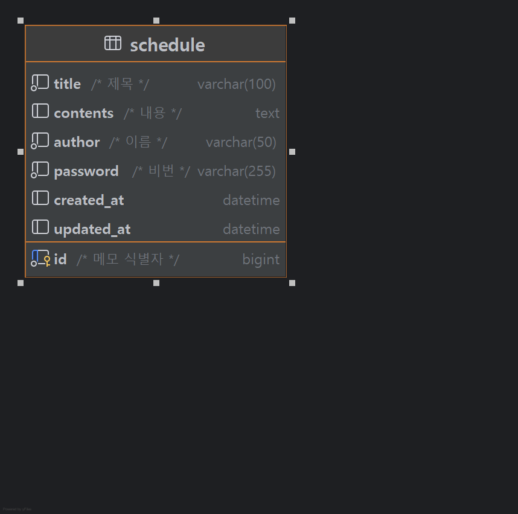

일정 관리 앱 만들기

필수 구현

Lv 0 : API 명세 및 ERD 작성

Lv 1 : 일정 생성 및 조회

Lv 2 : 일정 수정 및 삭제

도전 구현

Lv 3 : 연관 관계 설정

Lv 4 : 페이지 네이션

Lv 5 : 예외 발생 처리

Lv 6 : null 체크 및 특정 패턴에 대한 검증 수행

일정 API 설계

| 기능       | 메서드  | URL    | response | 상태코드        |
|----------|------|--------|----------|-------------|
| 일정 등록    | post | /api   | 등록 정보    | 201 created |
| 일정 목록 조회 | GET  | /api   | 전체 목록 조회 | 200 OK      |
| 일정 선택 조회 | GET  | /api{/id} | 선택 목록 조회 | 200 OK      |
| 일정 수정    | PUT  | /api{/id}   | 선택 목록 수정 | 200 OK      |
| 일정 삭제    | DEL  | /api{/id}   | 일정 삭제    | 200 OK      |

ERD 작성

